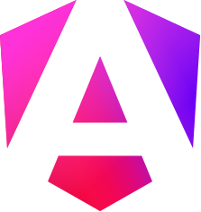



# Angular Notes 📝

This repository contains notes on Angular concepts, features, and best practices. During my self-learning and working with Angular.

## [⌚Debounce Time in Angular](https://github.com/kodoku-san/angular-notes/blob/main/debounce-time.md)

`KODOKU`
